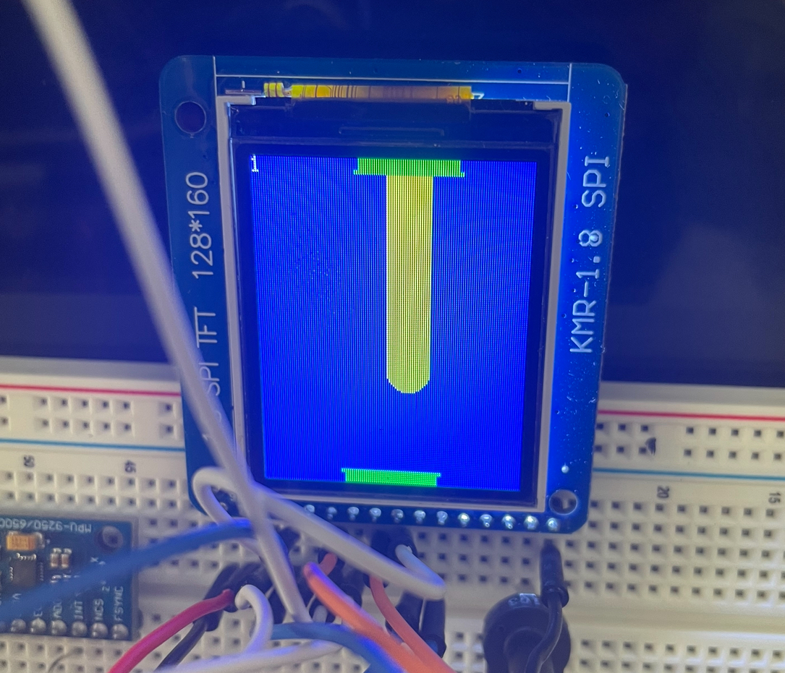
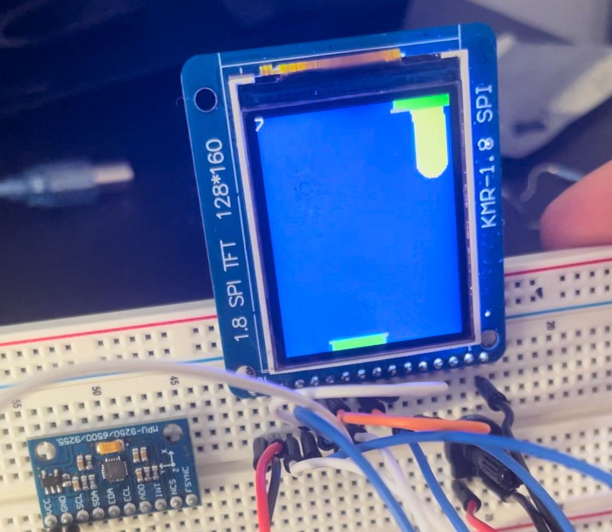
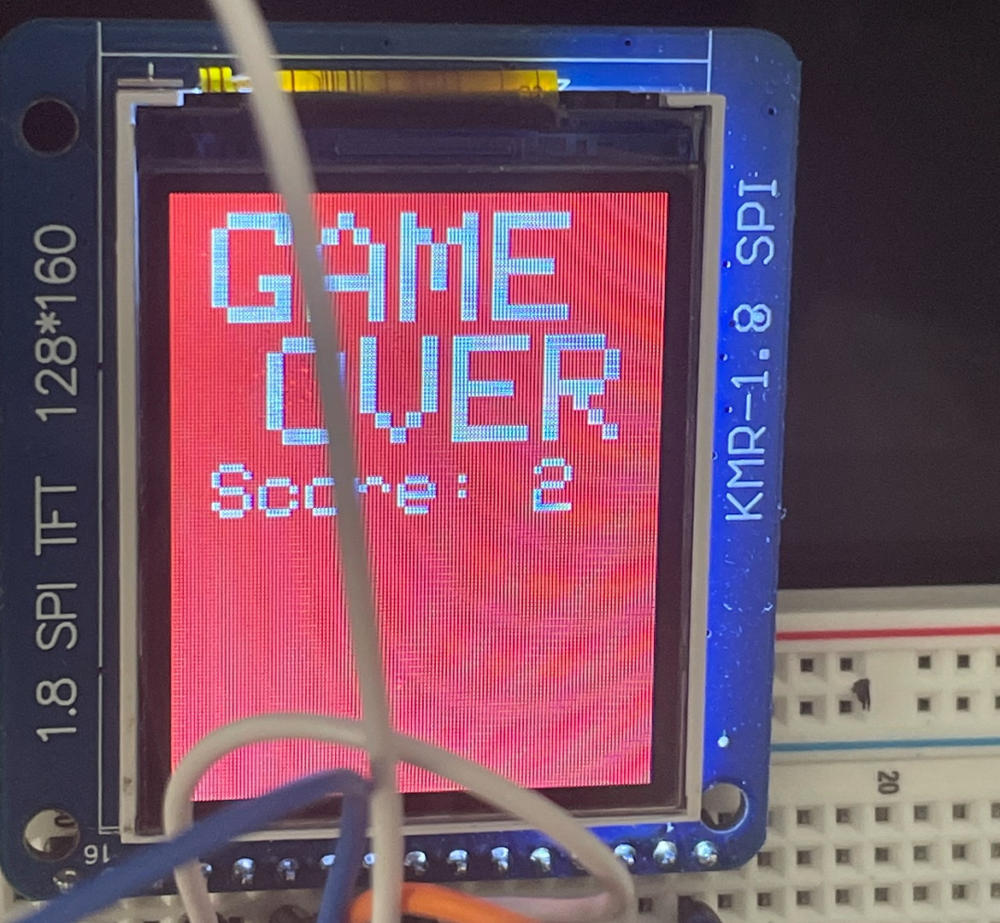

## Pipes Game

A simple game using the gyroscope and an LCD to fall into the opening pipe!

_The pipes continue to get smaller upon every sequential connection!_

| Screencast | Description |
| ---------- | ----------- |
| [YouTube](https://youtube.com/shorts/RmU1C4MuSO8?si=YyTCMUJMZ2fiyuRG) | Live demo of game working with commentary |

## Photos
Some example photos of the game running

    
    
    

## Wiring
The wiring combined the wiring diagrams of the [`lcd`](/lcd/) and [`mems`](/mems/) folders. The two diagrams do not overlap with using any pins so they can easily be combined.

### SPI
The LCD uses SPI for sending the pixel draw data via MOSI digital pinout ~11

### I2C
The MPU uses I2C for specifying the device and querying its registers for accelerometer data via SDA pinout

## Software
The [`level-jump`](/level-jump/) folder contains the code for running the game, based on the wiring schematics mentioned above