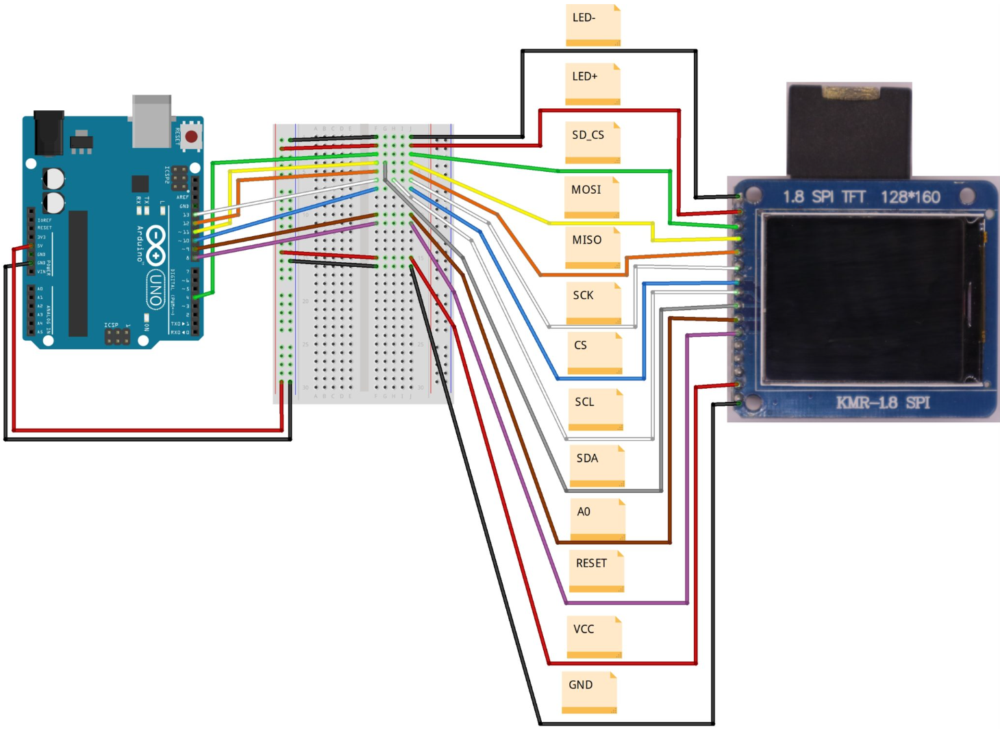
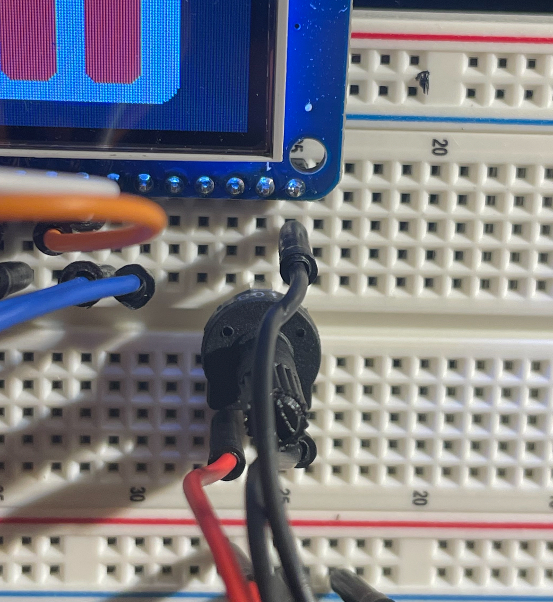

# LCD - TFT ST7735R

**The LCD used and wired is the [1.8" ST7735R SPI 128160 TFT LCD Display Module](http://hiletgo.com/ProductDetail/2157911.html)**

    
    

I could not find a datasheet for this specific model and pinout but there is a helpful article:
> [Arduino Tutorial: Making the KMR-1.8 SPI (TFT Display) work!](https://mschoeffler.com/2019/06/20/arduino-tutorial-making-the-kmr-1-8-spi-tft-display-work/)

## Wiring Diagram

- This diagram has been copied from [Michael Schoeffler's](https://mschoeffler.com/) article mentioned above

### My changes:

#### 3.3V Power Supply

- I switched from 5V to **3.3V** due to seeing comments about 3.3V being the correct amount
- And on the [Amazon listing](https://www.amazon.com/dp/B00LSG51MM?ref=ppx_yo2ov_dt_b_fed_asin_title), the product specification says:
    > this LCD is 3.3V, which can not receive 5V signals from the Arduino

#### Potentiometer for the backlight

- I wired a potentiometer to the `LED+` pin
- This improved the backlight clarity when adjusting the potentiometer resistance to what looked good

# Arduino IDE

Required libraries

| Library name | Version |
| ------------ | ------- |
| [Adafruit ST7735 And ST7789 Library](https://github.com/adafruit/Adafruit-ST7735-Library) | 1.10.4 |
| [Adafruit GFX Library](https://github.com/adafruit/Adafruit-GFX-Library) | 1.11.10 |