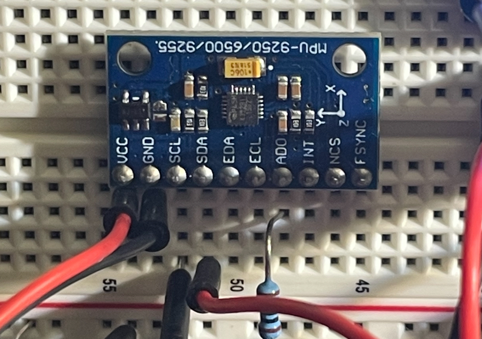

# MEMS Integration

Integrating the **MPU-9250** with the **Arduino Uno Rev 3** via the I2C protocol

## Documents

- [MPU-9250 Register Map](https://invensense.tdk.com/wp-content/uploads/2015/02/RM-MPU-9250A-00-v1.6.pdf)
    - Use the register map to determine what address to start reading bytes from the IC
    - We care about the accelerometer / gyroscope and that block of data starts at __0x3B__

## I2C

- Being done through the [Wire.h](https://www.arduino.cc/reference/en/language/functions/communication/wire/) library built into Arduino IDE

## Circuit Diagram


```
      10 uF Capacitor
┌───────────┬───────┐
│┌──────────┴──────┐│
││ ╔══════════╗    ││ ╔═════════╗
││ ║ Arduino  ║    ││ ║ MPU9250 ║
││ ║ Uno  SCL >──┐ │└─< VCC     ║
││ ║      SDA >─┐│ └──< GND     ║
││ ║          ║ │└────< SCL     ║
│└─< GND      ║ └─────< SDA     ║
└──< 3.3V     ║       ║         ║
   ╚══════════╝       ╚═════════╝
```

## Picture of wiring

- The `AD0` pin is wired with a resistor to **ground**
    - Therefore the pin is still set to LOW rather than HIGH
    - This is not necessary but then pin was originally wired to be HIGH but then moved the resistor to groundbecause the default address is fine